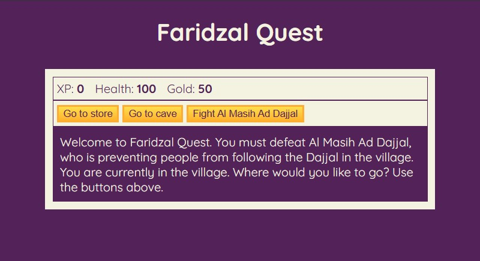

# Faridzal Quest - Role Playing Game

Faridzal Quest is a web-based RPG game where players battle monsters and ultimately defeat Al Masih Ad Dajjal. Built using HTML, CSS, and JavaScript, this game provides a simple yet engaging adventure experience.

## Table of Contents

- [Preview](#preview)
- [How to Play](#how-to-play)
- [Features](#features)
- [Project Structure](#project-structure)
- [Getting Started](#getting-started)
- [License](#license)

## Preview



## How to Play

1. Use the action buttons on the screen to explore locations such as:
   - **Store**: Buy health or weapons.
   - **Cave**: Fight monsters.
   - **Fight Al Masih Ad Dajjal**: Battle the final boss.
   
2. Gather **XP** and **Gold** to enhance your character.

3. When fighting monsters, choose between **Attack**, **Dodge**, or **Run** to counter enemy attacks.

4. Continue your quest until you successfully defeat Al Masih Ad Dajjal.

## Features

- **Three Levels of Monsters**: Battle the "followers of the Dajjal," "orc," and **final boss** "Al Masih Ad Dajjal."
- **Weapon Inventory**: Boost your attack power by upgrading to stronger weapons.
- **Purchasing Options**: Use **Gold** to buy health and weapons in the store.
- **Easter Egg**: Discover a hidden game feature with a chance to win additional **Gold**.

## Project Structure

- `index.html` - The main page displaying the game elements.
- `style.css` - Game styling and design.
- `script.js` - Game logic, including battle system, level progression, and navigation.

## Getting Started

1. Clone this repository:

   ```bash
   git clone https://github.com/username/faridzal-quest.git
   cd faridzal-quest

2. Open index.html in your browser to start playing.

## License

This game is free to use for non-commercial purposes. Feel free to modify and further develop it for your personal projects!
